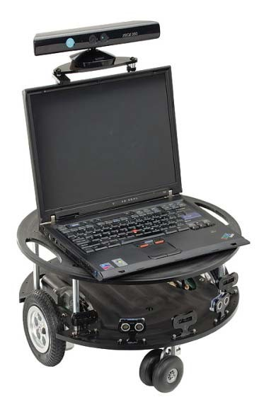
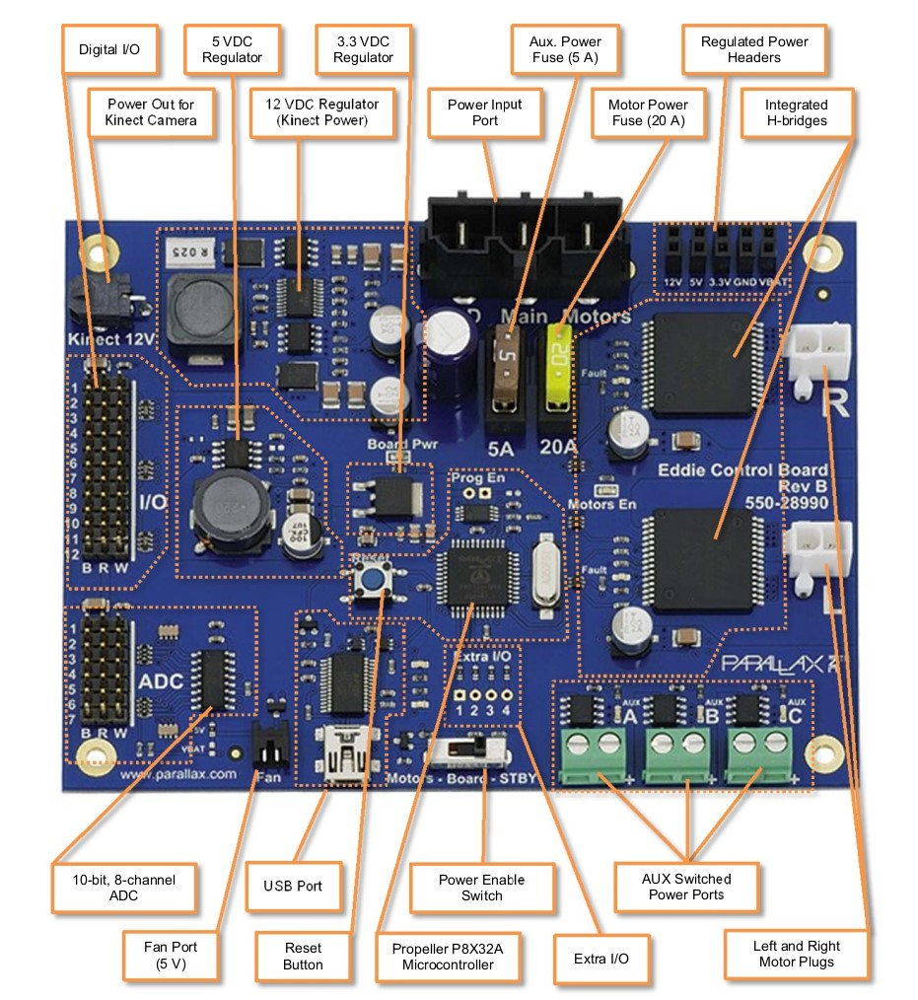
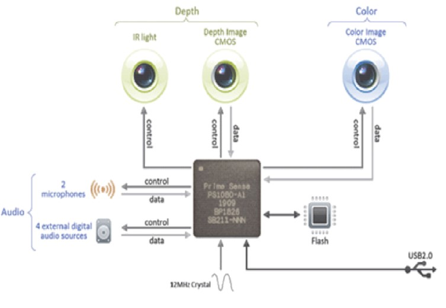
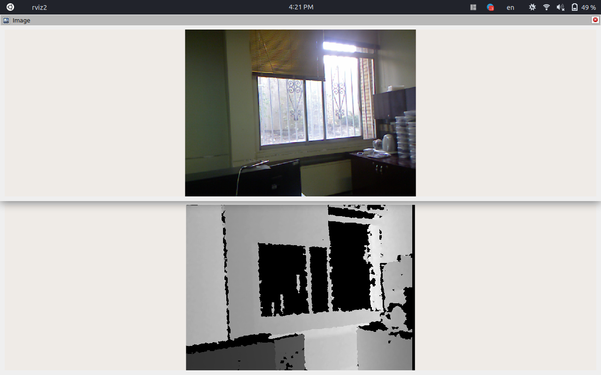
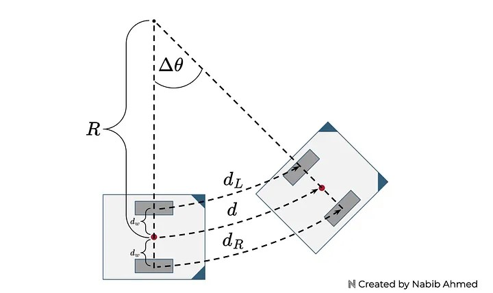
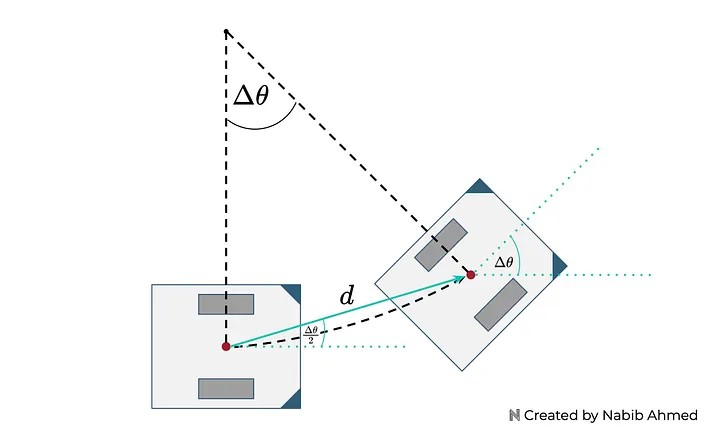
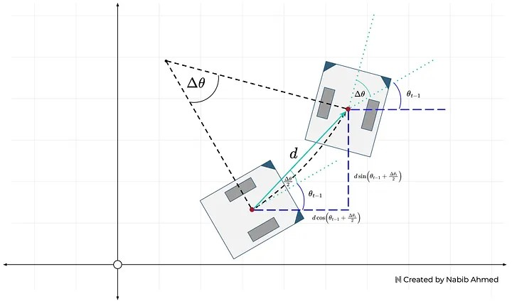
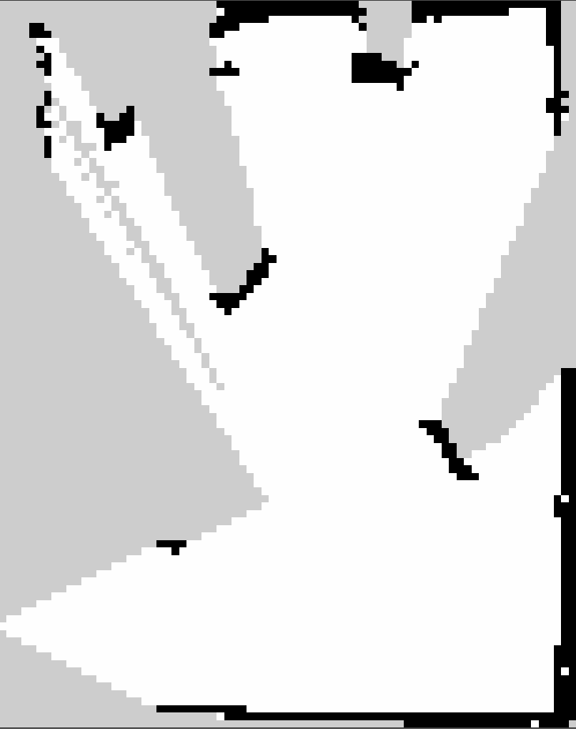
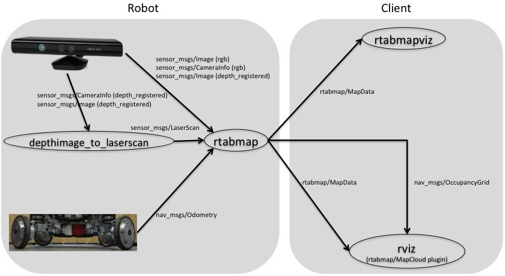

This is a report on the exciting exploration of 2D and Visual SLAM and navigation with Eddie, a versatile differential drive robot.


In this report, we delve into a detailed analysis of Eddie's hardware and software components, including its firmware command set. We also discuss the challenges we encountered while setting up Eddie's Kinect sensor and the step-by-step process of bringing Eddie to life and teleoperating it from a static laptop.


You can see our attempt at teleoperating Eddie [here](https://www.youtube.com/watch?v=LtZwPk3DaKk).


Then, we unravel Eddie's kinematic model and delve into the mathematical intricacies involved in obtaining the odometry for our differential drive robot. We present a thorough analysis of the formulas and calculations used to precisely track Eddie's movements.

Next, we deep dive into 2D SLAM and ROS2 navigation techniques, testing the methods to create a map of Eddie's environment and exploring how Eddie successfully navigates through it.

[Here](https://www.youtube.com/watch?v=gvVIIlhwI-I) is our attempt at testing slam_toolbox alongside nav2.


Lastly, we explore various visual SLAM libraries. Ultimately we decide on RTABMap, and we evaluate its performance with Eddie.


The repo containing all the files can be found [here](https://github.com/zahra-niazi/robotics-spring2023/tree/main/Eddie).

The report can be found [here](https://drive.google.com/file/d/12r0Ks9mESJQqtTjwi0NvT9OFLVgd2Yns/view?usp=sharing)!




# Table of contents

* [Introduction]()

## Eddie setup and bringup

* [Hardware Subsystems](#hardware-subsystems)
* [Control Board Firmware Command Set](#control-board-firmware-command-set)
* [Software Subsystems](#software-subsystems)
* [Setting up the Kinect](#setting-up-the-kinect)
* [Bringup](#bringup)
* [Networking](#networking)

## Odometry

* [Motor Control](#motor-control)
* [Wheel Odometry Model](#wheel-odometry-model)

## SLAM and Navigation

* [2D SLAM](#2d-slam)
* [Nav2](#nav2)
* [vSLAM](#vslam)


# Hardware Subsystems

Eddie is a versatile mobile robotics development platform. Eddie is equipped with 3D vision capabilities, utilizing the Microsoft Kinect, allowing it to perceive its surroundings in three dimensions.&#x20;

The platform is versatile, supporting applications like autonomous navigation, machine vision system development, tele-presence robots, personal assistant robots, security and surveillance robots, and crowd interaction and advertising.

## Eddie Platform

Eddie is a differential drive robot featuring a microcontroller with an integrated PID, two optical wheel encoders, two PWM driven motors, and two lead-acid batteries. The robot’s structure comprises a pair of top and bottom decks, along with an undercarriage designed to hold the batteries securely.


{:style="display:block; margin-left:auto; margin-right:auto"}
<p style="text-align: center;">Eddie Platform</p>


## **Range Sensors**

On its base, there are five distance sensors placed for collision avoidance. This sensor array comprises three infrared (IR) sensors and two ultrasonic sensors.

## **Wheel Encoders**

The 36-position Quadrature Encoders offer a reliable method to track the position and speed of each wheel continuously. When used with the included Encoder disks, each Encoder assembly provides a basic resolution of 36 positions per rotation. However, since there are two sensors in each assembly, the potential resolution increases to 144 positions per full tire rotation. This equates to a linear resolution of approximately 0.13 inches of travel per drive assembly when using the standard six-inch tires.&#x20;

It’s important to note that the actual resolution may be limited by the amount of backlash in the gear motor assemblies, which is approximately +/- 0.175 linear inches. The Position Controllers are compatible with any microcontroller via a single-wire half-duplex asynchronous serial communication (UART) bus.

## **Board**

The Eddie Control Board provides a complete single-board solution to control the Eddie Robot Platform. It utilizes the powerful Propeller P8X32A microcontroller, boasting eight 32-bit cores for impressive performance and versatility. The board incorporates high-current motor drivers, an eight-channel 10-bit ADC, and ample digital I/O options. It communicates via a USB mini-B connector, which enumerates as a serial COM port.

{:style="display:block; margin-left:auto; margin-right:auto"}
<p style="text-align: center;">Board Overview</p>


Most of the Propeller’s 32 general purpose I/O pins are used to interface with on-board peripherals, or connect to headers for sensor interfacing. The Digital I/O pins are brought out to twelve 3-pin headers near the edge of the board. The order of the pins from left to right is: Ground, 5V, Signal.

* The 1st and 2nd pins are connected to our two ultrasonic sensors.

For the analog to digital converter, the board is equipped with the Microchip MCP3008 which is an 8-channel, 10-bit ADC.

* The left-most IR Sensor cable is connected to “AD1”, the center IR sensor to “AD2”, and the right-most IR Sensor to “AD3”.

The three-pin cable from the right Position Controller is connected to Pin-set 11 in the “Encoders” section of the Control Board.

## Camera

The Kinect for Xbox 360 is a combination of software and hardware, featuring a range chipset technology by PrimeSense, which uses an infrared projector and camera to determine the location of nearby objects in 3D.

The Kinect sensor consists of an RGB camera, depth sensor, and microphone array, allowing for full-body 3D motion capture, facial recognition, and voice recognition capabilities.&#x20;

The depth sensor employs an infrared laser projector and monochrome CMOS sensor to capture 3D video data under any lighting conditions, with an adjustable sensing range and automatic calibration for different environments.

The software technology of Kinect enables advanced gesture recognition, facial recognition, and voice recognition, making it capable of simultaneously tracking up to six people.&#x20;

The Kinect’s various sensors output video at frame rates ranging from approximately 9 Hz to 30 Hz, with different resolutions and color formats. The sensor has a practical ranging limit of 1.2–3.5 meters and a field of view of 57° horizontally and 43° vertically, providing a high resolution of over 1.3 mm per pixel.&#x20;

To power the motorized tilt mechanism of the Kinect sensor, a proprietary connector combining USB communication and additional power is used, while older models require a special power supply cable that splits the connection into separate USB and power connections.

{:style="display:block; margin-left:auto; margin-right:auto"}
<p style="text-align: center;">Kinect Components</p>


# Control Board Firmware Command Set

The Eddie Control Board is a complete robot controller and sensor-interface solution. Parallax’s ready-to-go Eddie Control Board firmware, designed for the Eddie Robot Platform provides an easy-to-use serial command interface to control and manage all of the on-board peripheral electronics such as motor drivers, digital I/O, and analog to digital converter (ADC) channels.

The Eddie Control Board communicates over USB; and when connected to a PC, the board enumerates as a serial COM port. Configure the COM port to use these settings of 115.2 kBaud, 8-bit character size, 1 stop bit and no parity.

All commands adhere to the same general format which is shown below:

**Input:** $$ \textcolor{#556B2F}{<cmd>}[\textcolor{#CB4154}{<WS>}\textcolor{#556B2F}{<param1>}...\textcolor{#CB4154}{<WS>}\textcolor{#556B2F}{<paramN>}]\textcolor{#CB4154}{<CR>} $$

**Response (Success):** $$ [\textcolor{#556B2F}{<param1>}...\textcolor{#CB4154}{<WS>}\textcolor{#556B2F}{<paramN>}]\textcolor{#CB4154}{<CR>} $$

**Response (Failure):** $$ \textcolor{#4169E1}{Error}[\textcolor{#CB4154}{<SP>}-\textcolor{#CB4154}{<SP>}\textcolor{#556B2F}{<verbose\_ reason>}]\textcolor{#CB4154}{<CR>} $$


In this format:

* $$ \textcolor{#556B2F}{<cmd>} $$ represents the command mnemonic.
* $$ \textcolor{#556B2F}{<param1>}...\textcolor{#556B2F}{<paramN>} $$ are optional parameters required by the command or mode. Numbers are always entered as hexadecimal values, and signed values use two’s complement.
* $$ \textcolor{#CB4154}{<WS>} $$ refers to one or more whitespace characters, which can be spaces (ASCII 32) or tabs (ASCII 9).
* $$ \textcolor{#CB4154}{<CR>} $$ is a single carriage-return character (ASCII 13).
* $$ \textcolor{#CB4154}{<SP>} $$ is a single space character (ASCII 32).
* $$ \textcolor{#556B2F}{<verbose\_ reason>} $$ is an optional error message displayed when verbose mode is enabled (using the VERB command).

Allowed characters are in the ASCII range from 32 to 126, except for carriage return (ASCII 13) and tab (ASCII 9). Commands can have up to 254 characters, including the terminating carriage return character. Anything beyond this limit is ignored as an invalid command. The command handler only processes and responds after receiving the carriage return character.

## Table 1: Eddie Command Set Description: _Interface_

<table data-full-width="false"><thead><tr><th width="109.19999999999999">Cmd</th><th width="134">Input Params</th><th width="117">Return Params</th><th width="224">Values</th><th>Description</th></tr></thead><tbody><tr><td>HWVER</td><td></td><td>&#x3C;version></td><td>version=0..FFFF</td><td>Get hardware version</td></tr><tr><td>VER</td><td></td><td>&#x3C;version></td><td>version=0..FFFF</td><td>Get firmware version</td></tr><tr><td>VERB</td><td>&#x3C;mode></td><td></td><td>mode= 0(off), 1(on)</td><td>Set verbose mode</td></tr><tr><td>WATCH</td><td>&#x3C;mode></td><td></td><td>mode= 0(off), 1(on)</td><td>Set watch mode</td></tr><tr><td>BLINK</td><td>&#x3C;pin>&#x3C;rate></td><td></td><td><p>pin=0.. 1F </p><p>rate=0..FFFF</p></td><td>Toggle pin at a specified rate in increments of 0.1Hz</td></tr></tbody></table>

## Table 2: Eddie Command Set Description: _I/O Control_

<table data-full-width="false"><thead><tr><th width="102.19999999999999">Cmd</th><th width="141">Input Params</th><th width="147">Return Params</th><th>Values</th><th>Description</th></tr></thead><tbody><tr><td>IN</td><td>&#x3C;bitmask></td><td></td><td>bitmask=0..7FFFF</td><td>Set GPIO pins in bitmask to inputs</td></tr><tr><td>OUT</td><td>&#x3C;bitmask></td><td></td><td>bitmask=0..7FFFF</td><td>Set GPIO pins in bitmask to outputs</td></tr><tr><td>LOW</td><td>&#x3C;bitmask></td><td></td><td>bitmask=0..7FFFF</td><td>Set GPIO pins in bitmask to low (only applies to output pins)</td></tr><tr><td>HIGH</td><td>&#x3C;bitmask></td><td></td><td>bitmask=0..7FFFF</td><td>Set GPIO pins in bitmask to high (only applies to output pins)</td></tr><tr><td>INS</td><td></td><td>&#x3C;bitmask></td><td>bitmask=0..7FFFF</td><td>Get GPIO pins currently set as inputs</td></tr><tr><td>OUTS</td><td></td><td>&#x3C;bitmask></td><td>bitmask=0..7FFFF</td><td>Get GPIO pins currently set as outputs</td></tr><tr><td>LOWS</td><td></td><td>&#x3C;bitmask></td><td>bitmask=0..7FFFF</td><td>Get GPIO pins currently set as low</td></tr><tr><td>HIGHS</td><td></td><td>&#x3C;bitmask></td><td>bitmask=0..7FFFF</td><td>Get GPIO pins currently set as high</td></tr><tr><td>READ</td><td></td><td>&#x3C;bitmask></td><td>bitmask=0..7FFFF</td><td>Get current state (high/low) of all GPIO pins</td></tr></tbody></table>

## Table 3: Eddie Command Set Description: _Sensor Interfacing_

<table data-full-width="false"><thead><tr><th width="125.19999999999999">Cmd</th><th width="138">Input Params</th><th width="203">Return Params</th><th width="189">Values</th><th>Description</th></tr></thead><tbody><tr><td>SPNG</td><td>&#x3C;bitmask></td><td></td><td>bitmask=0..FFFF</td><td>Set pins in bitmask to act as GPIO pins</td></tr><tr><td>SGP</td><td>&#x3C;bitmask></td><td></td><td>bitmask=0..7FFFF</td><td>Set pins in bitmask to act as GPIO pins</td></tr><tr><td>PING</td><td></td><td><p>&#x3C;value1>[&#x3C;value2></p><p>...&#x3C;valueN>]</p></td><td>value=0,12..B54</td><td>Get PING))) sensor sonar measurements (one 12-bit value per sensor)</td></tr><tr><td>ADC</td><td></td><td>&#x3C;value1>...&#x3C;value8></td><td>value=0..FFF</td><td>Get all ADC values (12-bit values)</td></tr></tbody></table>

## Table 4: Eddie Command Set Description: _Motor Control_

<table data-full-width="false"><thead><tr><th width="110.19999999999999">Cmd</th><th width="135">Input Params</th><th width="144">Return Params</th><th>Values</th><th>Description</th></tr></thead><tbody><tr><td>GO</td><td>&#x3C;left>&#x3C;right></td><td></td><td>left/right=80..7F</td><td>Set motor power (signed byte)</td></tr><tr><td>GOSPD</td><td>&#x3C;left>&#x3C;right></td><td></td><td>left/right=8000..7FFF</td><td>Set motor speed (signed word)</td></tr><tr><td>STOP</td><td>&#x3C;dist></td><td></td><td>dist=0..FFFF</td><td>Slow to a stop over specified distance</td></tr><tr><td>TRVL</td><td>&#x3C;dist>&#x3C;speed></td><td></td><td><p>dist=8000..7FFF </p><p>speed=1..7F or 1..FF</p></td><td>Travel a specified distance in a straight line, ramping up to a maximum specified speed</td></tr><tr><td>TURN</td><td>&#x3C;angle>&#x3C;speed></td><td></td><td><p>dist=8000..7FFF </p><p>speed=1..7F or 1..FF</p></td><td>Rotate in place by a specified angle, ramping up to a maximum specified speed</td></tr><tr><td>STOP</td><td>&#x3C;rate></td><td></td><td>rate=1..7F or 1..FF</td><td>Set rate of acceleration/deceleration</td></tr><tr><td>SPD</td><td></td><td>&#x3C;left>&#x3C;right></td><td>left/right=8000..7FFF</td><td>Get the current average speed (positions per second) for both wheels</td></tr><tr><td>HEAD</td><td></td><td>&#x3C;angle></td><td>angle=0..168 (decimal 0..359)</td><td>Get the current heading (in degrees) relative to start</td></tr><tr><td>DIST</td><td></td><td>&#x3C;left>&#x3C;right></td><td>left/right=80000000.. 7FFFFFFF</td><td>Get the current average speed (positions per second) for both wheels</td></tr><tr><td>RST</td><td></td><td></td><td></td><td>Reset the distance and heading values to 0</td></tr></tbody></table>

# Software Subsystems

## Robot Communication: **$$ \textcolor{#8E4585}{\texttt{eddiebot\_bringup}} $$**

The communication with the board involves establishing a connection between the robot control board and our ROS2 programs, enabling seamless data exchange. This software acts as a pathway that conveys and receives data between two of our major hardware components. Specifically, this sub-system serves as the means to convey the desired velocity information from the control system to be executed by the robot’s firmware board.&#x20;

## Description: $$ \textcolor{#8E4585}{\texttt{eddiebot\_description}} $$

This package contains files and data used to describe the structure of eddie. It includes URDF files to define the physical properties and kinematic structure of eddie. This package enables accurate simulation of Eddie’s structure and movement within the ROS environment. This is crucial for visualizing and controlling the robot in a virtual space before deploying it in the physical world.

The `diff_drive` plugin is a component added to the URDF files to simulate the differential drive mechanism that eddie uses.

The `joint_state_publisher` plugin is another component added to the URDF files. It is used to simulate the movement of Eddie’s wheels. `joint_state_publisher` helps in updating the positions and orientations of robot joints based on the data received from the robot’s actuators.

In the launch file we run two nodes:

* `robot_state_publisher`: The robot\_state\_publisher reads the URDF description file and generates static transformations (tf static transforms). These transformations define the spatial relationship between different components of the robot, such as its base, wheels and different sensors.
* `joint_state_publisher`: The joint\_state\_publisher node sends dynamic transformations from the wheels to the robot\_state\_publisher. These dynamic transformations update the joint positions based on the movement of the wheels, allowing the `robot_state_publisher` to accurately track and represent the robot’s current state.

## Simulation: $$ \textcolor{#8E4585}{\texttt{eddiebot\_gazebo}} $$

The eddiebot\_gazebo package enables us to test and experiment with Eddie’s behavior in the Gazebo simulation environment.

When we run the main launch file in this package, it sets up the Gazebo simulator, creating a simulated environment where Eddie can exist and interact. Once Gazebo is up, we also spin a node to "spawn" Eddie inside the simulated world. Meaning we place the robot model, represented by a URDF file, into the Gazebo environment. We do this by launching the `eddiebot_description` launch file mentioned before.

This step essentially brings Eddie to life in the simulation, and we can now control and observe its actions as if it were a real physical robot. To ensure communication between Gazebo and the ROS2 ecosystem, the eddiebot\_gazebo package establishes a connection between their respective topics.

## Custom Interfaces: $$ \textcolor{#8E4585}{\texttt{eddiebot\_msgs}} $$

In the eddiebot\_msgs package, we define the custom interfaces for Eddie, the robot. This package allows us to define the specific topics and services through which we can communicate information about Eddie’s current state and control its movements.

Firstly, we define the topics where information about the robot’s current state will be published. This includes data such as its current speed, angle, and sensor inputs. By publishing this information on specific topics, other nodes in the ROS2 ecosystem can subscribe to these topics and receive real-time updates on Eddie’s state. This enables different components of the system to access and utilize this information for various purposes, such as perceiving the environment, making decisions or performing actions based on Eddie’s current state.

Additionally, we define services that can be used to communicate with the robot and instruct it to move or turn. Services in ROS2 provide a request-response mechanism, allowing nodes to send requests to specific services and receive corresponding responses. For Eddie, these services can be used to send commands to the robot, such as specifying a desired movement or rotation. The robot can then receive these commands, process them, and respond accordingly, enabling control over Eddie’s actions through the defined services.

By defining these custom interfaces in the eddiebot\_msgs package, we establish a standardized and consistent way to exchange information and control commands between different components of the system, facilitating effective communication and interaction with Eddie.

## Odometry: $$ \textcolor{#8E4585}{\texttt{eddiebot\_odom}} $$

The eddiebot\_odom package plays a crucial role in enabling Eddie to understand its position and movement within the environment. It is responsible for publishing odometry information, which is an estimation of Eddie’s position and orientation based on the motion of its wheels. Odometry is essential for mapping and localization tasks in robotics.

Since Eddie doesn’t have an IMU (Inertial Measurement Unit), which could provide direct information about its orientation and acceleration, the package relies on wheel encoders. Wheel encoders are sensors mounted on the robot’s wheels that measure the rotation of the wheels. By analyzing the data from these encoders, the eddiebot\_odom node can calculate how far each wheel has turned and, consequently, estimate Eddie’s overall movement.

The process starts with the eddiebot\_odom node subscribing to the topic where the wheel encoder data is published. As the wheels move, the encoders send real-time information to the node about the rotations. Using this information, the node calculates the incremental movement of Eddie in terms of distance and angular change.

To keep track of Eddie’s pose (position and orientation) over time, the node continuously updates the transformation between two frames: the `/odom` frame and the `/base_footprint` frame.

* The `/odom` frame represents Eddie’s initial position in the world, usually set at the robot’s starting point. The coordinate frame called odom is a world-fixed frame. The pose of a mobile platform in the odom frame can drift over time, without any bounds. This drift makes the odom frame useless as a long-term global reference. However, the pose of a robot in the odom frame is guaranteed to be continuous, meaning that the pose of a mobile platform in the odom frame always evolves in a smooth way, without discrete jumps. The odom frame is useful as an accurate, short-term local reference, but drift makes it a poor frame for long-term reference.
* The `/base_footprint` frame is attached to Eddie’s base chassis. The coordinate frame called `base_link` is rigidly attached to the mobile robot base. The base\_link can be attached to the base in any arbitrary position or orientation; for every hardware platform there will be a different place on the base that provides an obvious point of reference.

By knowing how far Eddie has moved from its initial position and the angular changes during its motion, the node can estimate the transformation between these frames. This allows Eddie to understand its current pose relative to where it started, effectively providing odometry information.

Having accurate odometry enables Eddie to navigate its environment more effectively. It can use this information to create a map of the environment. However, it’s worth noting that odometry estimates may drift over time due to inaccuracies and wheel slippage, especially in complex environments. To improve localization accuracy, other sensor modalities like visual odometry or an IMU can be used in conjunction with wheel encoders.

## Visualization: $$ \textcolor{#8E4585}{\texttt{eddiebot\_rviz}} $$

The eddiebot\_rviz package is responsible for visualizing Eddie’s current state and movement in a visualization environment like RViz.

We run the `eddiebot_description` launch file within the eddiebot\_rviz package, which loads the robot’s URDF model into RViz. This URDF model includes information about Eddie’s physical structure, joints, sensors, and other components, allowing RViz to create a visual representation of the robot accurately.

The eddiebot\_rviz package subscribes to various topics that publish real-time data about Eddie’s state and movements. It subscribes to topics that provide information about joint angles and sensor data. With access to the subscribed topics, the eddiebot\_rviz package can update the visualization of Eddie’s state in real-time within the RViz environment. As the robot moves, the URDF model’s joints and links are updated according to the received data, enabling you to see Eddie’s current pose and joint angles dynamically.

The real-time visualization in RViz allows us to interactively analyze Eddie’s behavior. We can observe how the robot responds to different commands and paths, assess its trajectory, and verify whether its movements align with the intended behavior. In addition to joint angles and pose, the eddiebot\_rviz package can also display other sensor data within RViz. For example, it can visualize data from range sensors, cameras, or any other sensors equipped on the robot. This feature is valuable for understanding how the robot perceives its environment and how it responds to various stimuli.

## Velocity: $$ \textcolor{#8E4585}{\texttt{eddiebot\_vel\_controller}} $$

The eddiebot\_vel\_controller package subscribes to the `/cmd_vel` topic, where commands to move or rotate Eddie are published. These commands are in the Twist format which consists of linear and angular velocity components that define how Eddie should move in the environment.

Upon receiving the Twist messages from the `/cmd_vel` topic, the eddiebot\_vel\_controller extracts the linear and angular velocity values from the Twist message and converts them into simple velocity commands. Then it publishes these commands on the `eddie/simple_velocity` topic.

## SLAM and Navigation: $$ \textcolor{#8E4585}{\texttt{eddiebot\_nav}} $$

The eddiebot\_nav package is the central location for managing all the launch files configuring the navigation stack and SLAM tools used in the Eddie robot’s autonomous navigation capabilities. Eddie uses the slam\_toolbox for 2D SLAM. SLAM is a critical process that allows the robot to create a map of its environment while simultaneously determining its own position within that map. The `slam_toolbox` is a powerful library that performs SLAM algorithms to achieve accurate mapping and localization using sensor data from onboard sensors like LIDAR and odometry. Because Eddie is not equipped with a LIDAR, we launch the `depthimage_to_laserscan` package to extract laser scans.

In addition to 2D SLAM, the eddiebot\_nav package also explores vSLAM using RTAB-Map. RTAB-Map is a popular vSLAM library that enables the robot to construct 3D maps of the environment using both visual and depth information from RGB-D cameras. This advanced vSLAM technique enhances the accuracy and richness of the mapping process, enabling Eddie to navigate more efficiently in complex environments. For autonomous navigation, Eddie utilizes the Nav2 framework. The navigation stack is a collection of algorithms and components responsible for planning and executing the robot’s path from its current location to the target destination. In this launch file we also run the static transformations from the robot’s frame to the RGB and depth frames.

# Setting up the Kinect

The `kinect_ros2` package is a component that allows the Eddie robot to interface with a Microsoft Kinect sensor and utilize its RGB and depth images for perception tasks in ROS2.&#x20;

This package spins a node responsible for receiving the RGB and depth images from the Kinect sensor and storing them in memory. Then, at regular intervals, it publishes the data from these images on specific ROS2 topics. The topics it publishes are:

* `image_raw`: This topic contains the raw RGB image data captured by the Kinect sensor. It provides a continuous stream of color images representing what the camera perceives from its viewpoint.
* `camera_info`: This topic carries calibration and intrinsic parameters of the camera. It includes information about the camera’s focal length, optical centers, and distortion coefficients. This data is essential for performing accurate transformations and geometric calculations in image processing.
* `depth/image_raw`: Here, the package publishes the raw depth image data captured by the Kinect sensor. The depth image provides information about the distance of objects from the camera. It is represented as a 2D array of depth values corresponding to each pixel in the RGB image.
* `depth/camera_info`: Similar to the `camera_info` topic, this topic contains calibration and intrinsic parameters specific to the depth camera. These parameters enable accurate depth mapping and 3D reconstruction from the depth image.

By publishing these topics, the `kinect_ros2` package enables other nodes in the ROS2 environment to subscribe to and access the Kinect sensor’s data for various perception and navigation tasks.


{:style="display:block; margin-left:auto; margin-right:auto"}
<p style="text-align: center;">Testing Kinect</p>


One of the issues we encountered was the presence of out-of-sync timestamps between the `camera_info` and `depth/camera_info` topics that were being published. These two topics provide important calibration and intrinsic parameters for the RGB camera and the depth camera, respectively.&#x20;

Having these parameters synchronized correctly is crucial for accurate perception and 3D reconstruction. When performing coordinate transformations between RGB and depth images or other perception tasks, using unsynchronized timestamps can lead to misalignments and inaccurate results.&#x20;

This affects the quality of visual data and hinders the performance of perception algorithms. Also in applications like mapping and navigation, incorrect timestamps can introduce errors in robot localization and obstacle avoidance. These errors can potentially lead to collisions or inefficient path planning. Accurate timestamps are crucial for correctly associating corresponding data from different sensors or perception modules. With out-of-sync timestamps, the associations can become incorrect, leading to flawed data interpretations.

To address this issue, we fixed the out-of-sync timestamps. We ensured that both topics publish their data with matching timestamps, ensuring that the calibration and intrinsic parameters correspond accurately to the corresponding RGB and depth images.&#x20;

By resolving the timestamp synchronization problem, we improved the quality and reliability of our perception and mapping processes. It allowed our robot to better perceive and interpret the environment, leading to more accurate navigation and decision-making capabilities. As a result, the overall performance and robustness of our robot’s perception system were greatly enhanced, allowing it to operate more effectively and efficiently in its environment.
# Bringup

After successfully setting up the Kinect package, we proceeded to bring up Eddie and test his movement. The steps we followed are as follows:

## Granting USB permissions:&#x20;

We connected the USB cable between Eddie and our laptop and executed the command "sudo chmod a+rw /dev/ttyUSB0" to give the necessary permissions for communication with Eddie’s control board.

```sh
sudo chmod a+rw /dev/ttyUSB0
```

## Bringing up Eddie:&#x20;

To initiate the robot’s functionality, we ran the command "" This command launched the required ROS2 nodes responsible for communicating with Eddie’s control board and enabled communication within the ROS2 environment.

```sh
ros2 launch eddiebot_bringup eddie.launch.yaml
```

## Launching Navigation Stack:&#x20;

To enable navigation capabilities, we executed the following command. This step published static transforms specified in the `eddiebot_odom` package and established transformations between the chassis and the base link of our sensors.

```sh
ros2 launch eddiebot_nav eddiebot.launch.py
```

## Teleoperating Eddie:&#x20;

Finally, to control Eddie’s movement, we ran the following command. This command allowed us to teleoperate Eddie by sending velocity commands to the robot, thus enabling movement in the desired direction.

```sh
ros2 run teleop_twist_keyboard teleop_twist_keyboard
```

By following these steps, we were able to successfully bring up Eddie, utilize the Kinect package for sensor data, and teleoperate the robot for movement using ROS2 commands. We also bring up RViz to get a better sense of how Eddie is being represented in the ROS2 environment:

```sh
ros2 run eddiebot_rviz view_model.launch.py description:='True'
```

You can see our attempt at teleoperating Eddie [here](https://youtu.be/LtZwPk3DaKk).
# Networking

To enable teleoperation of Eddie using two laptops, we need to ensure that both laptops are connected to the same network. This allows them to communicate with each other.&#x20;

In ROS2, the default middleware for communication is DDS (Data Distribution Service). DDS utilizes the concept of Domain ID to enable different logical networks to share a physical network.&#x20;

In ROS2, nodes within the same domain can discover and exchange messages with each other, while nodes in different domains cannot.&#x20;

By default, all ROS2 nodes use domain ID 0. The domain ID is used by DDS to calculate the UDP ports for discovery and communication.&#x20;

When a node starts, it broadcasts its presence to other nodes on the network within the same ROS domain, which is determined by the `ROS_DOMAIN_ID` environment variable. Nodes respond with their information, allowing the necessary connections to be established for communication between nodes.


By connecting the laptops in this manner, we can proceed with teleoperating Eddie. We can bring up rviz on the remote laptop, and configure it to display the RGB image from the Kinect sensor. This enables visualization of the camera feed on the remote laptop, providing a convenient way to monitor Eddie’s environment during teleoperation.
# Motor Control

As each wheel spins the sensor will gather data about the angular position change of the wheel. Once the encoder input has been captured it must be converted to linear velocity and used by a robotic kinematic model to create an estimate of the distance traveled and possible error. Two wheel encoders are used to deduce the speed and travel direction by measuring the number of pulses registered from each wheel.&#x20;

Each wheel encoder has two sensors and is capable of registering a distance resolution of 1/36th of the robot’s wheel circumference. The Position Controllers on Eddie use a quadrature encoder system to reliably track the position and speed of each wheel at all times. With the included plastic encoder disks, each Position Controller has a resolution of 36 positions per rotation; this equates to approximately 0.5 inches of linear travel per position using the included 6 inch tires.&#x20;

The Position Controllers calculate and report position and average speed data on command. Knowing that the sensor has 1/36th resolution of wheel circumference, the sensor produces 36 pulses for every complete revolution of the wheel. Based on this, the distance traveled in the duration of one pulse is given below:

$$
d=\frac{2\pi r}{36}
$$

```cpp
// COUNTS_PER_REVOLUTION 36
// WHEEL_RADIUS 0.1524 Wheel radius in meters
// // the distance of a wheel move forward when encoder increased by 1
// DISTANCE_PER_COUNT ((TWOPI * WHEEL_RADIUS) / COUNTS_PER_REVOLUTION)

// WHEEL_SEPARATION 0.3 two wheels center-to-center distance

// Called from the velocity callback.
// Set the values for the left and right wheels’ speeds
// so that Eddie can do arcs 
void EddieController::moveLinearAngular(float linear, float angular) {
    // Calculate wheel velocities and convert meter per second to position per second
    double left_command_speed = ((linear - angular * WHEEL_SEPARATION / 2.0) / WHEEL_RADIUS) / DISTANCE_PER_COUNT; 
    double right_command_speed = ((linear + angular * WHEEL_SEPARATION / 2.0) / WHEEL_RADIUS) / DISTANCE_PER_COUNT;
    sem_wait(&mutex_interrupt_);
    left_drive_speed = left_command_speed;
    righ t_drive_speed = right_command_speed;
    // this is not a pure rotation
    rotate_ = false;
    process_ = true;
    // cancel other moving commands in favor of this new one.
    interrupt_ = true;
    sem_post (& mutex_interrupt_ );
}
```
# Wheel Odometry Model

(Most of this are from [here](https://medium.com/@nahmed3536/wheel-odometry-model-for-differential-drive-robotics-91b85a012299).)

With the rotation data, alongside information on the encoder, such as the radius or circumference, we can estimate the distance traveled by the wheel.&#x20;

Since each slit represents some angle of rotation, knowing the number of slits passed informs us about the amount of rotation between time steps.&#x20;

For an optical encoder, where all the slits are equally spaced, we could get the total angle of rotation between time steps by multiplying the number of slits passed by the amount of rotation represented by a single slit.&#x20;

After we determine the angle of rotation, we can multiply it by the circumference of the encoder to get the distance traveled by the wheel.&#x20;

The goal of an odometry model is to estimate the position and orientation of the robot. To achieve this, we’ll leverage data from the rotary encoders, the dimensions of our robot, and geometry. The **encoder** will inform us of the **distance traveled by each wheel** at each time step.&#x20;

In terms of using the dimensions of our robot, the only dimension we need is the distance of the point from the left and right wheels. Since we defined our reference point to be located equidistant between the two wheels, we only need to keep track of one number.

Now let’s define some variables to keep track of these ideas:

{:style="display:block; margin-left:auto; margin-right:auto"}
<p style="text-align: center;">Figure 4</p>

* $$ d_L $$= distance traveled by the left wheel.&#x20;
* $$ d_R $$= distance traveled by the right wheel.
* $$ d_w $$= distance between the reference point and the wheels.&#x20;
* $$ d $$= distance traveled by the reference point.
* $$ \Delta \theta $$= A change in the angle of rotation.
* $$ R $$= radius of the curve containing the reference point.

$$ d_L $$ and $$ d_R $$ correspond to the **distance traveled by the wheel** at a certain time step. This information will come from our rotary encoder.

$$ d_w $$ can be derived by measuring the **distance between the two wheels** and dividing it in half since the point is equidistant from the two wheels.&#x20;

The last three variables are not directly measurable — instead, we need to use geometry to relate these variables to the measurable quantities.

We can start by using the arc length formula. The path for the left wheel, right wheel, and reference points are arcs.&#x20;

They all share the **same angle** and the **radius** for each can be expressed in terms of the **radius of the curve containing the reference point** and the **distance between the reference point and the wheels**.

$$
d =  R\Delta \theta
$$

$$
d_L = (R-d_w)\Delta \theta
$$

$$
d_R = (R+d_w)\Delta \theta
$$

Now we solve for the **change in the angle of rotation** in terms of measurable quantities, getting the following relationship:

$$
\Delta \theta = \frac{d_R - d_L}{2d_w}
$$

Now we solve for the **radius of the curve containing the reference point** by rearranging equations and plugging in what we know.&#x20;

$$
R = d_L \frac{2d_w}{d_R - d_L}+d_w
$$

Then, we solve for the **distance traveled by the reference point**.

$$
d = \frac{d_R + d_L}{2}
$$


> **Note**\
> We solved for all variables in terms of measurable quantities. Since we’re interested in the robot’s position and orientation, the key variables of interest would be the _**distance traveled by the reference point**_ and the _**change in the angle of rotation**_.&#x20;

The **distance traveled by the reference point** informs us of the **position** and the **change in the angle of rotation** informs us of the **orientation**. The radius of the curve containing the reference point, while useful for derivation, is not really needed anymore.

* _Now, we know the distance traveled, but not the direction._&#x20;
* _We know how much the orientation angle changed, but not the new orientation angle._&#x20;

So we start modifying our odometry model.

To simplify our model, we will represent the **distance traveled by the reference point** as a _**line**_ instead of a _**curve**_. We can make this simplification because typically, in wheel odometry with encoders, the data sampling is very high.&#x20;

What this means is that our encoders are able to collect data very frequently so the time window between measurements is very small. Since the time window is very small, the amount of motion captured by each time step will also be small.

&#x20;For our model, that means the curvature of the arc will be very small and _resemble a straight line_. Thus, it’s a safe assumption and simplification to represent our distance now as a straight line.&#x20;

We then calculate the **angle of the distance** in terms of a previously solved variable, and the **new orientation** of the robot as shown in Figure 5:

{:style="display:block; margin-left:auto; margin-right:auto"}
<p style="text-align: center;">Figure 5</p>


In Figure 6, the odometry model at time $t$ will add the **absolute orientation angle** from the previous time step.&#x20;

{:style="display:block; margin-left:auto; margin-right:auto"}
<p style="text-align: center;">Figure 6</p>


> **Important**\
> Notice that adding the orientation from the previous time step won’t change the _distance traveled by the reference point_ or the _change in angle of rotation_ as the formulas we derived from earlier don’t rely on the orientation angle (only the **traveled wheel distances**).&#x20;

Instead what does change is the **orientation** of the robot, from being relative between time steps to now being **absolute** on the coordinate plane.&#x20;

Thus, the **absolute orientation angle** at any time step can be defined by:

$$
\theta_t = \theta_{t-1} + \Delta \theta_t
$$

Using the distance traveled by the reference point and the angle of orientation from the previous time step plus the angle that results from motion, the **amount of distance traveled along the x and y directions** can be calculated:

$$
x_t = x_{t-1} + d cos(\theta_{t-1} + \frac{\Delta \theta_t}{2})
$$

$$
y_t = y_{t-1} + d sin(\theta_{t-1} + \frac{\Delta \theta_t}{2})
$$

{:style="display:block; margin-left:auto; margin-right:auto"}
<p style="text-align: center;">Figure 7</p>


```cpp
EddieOdomPublisher::EddieOdomPublisher(std::shared_ptr<rclcpp::Node> node_handle) : nh_(node_handle)
{
    odom_pub_ = nh_->create_publisher<nav_msgs::msg::Odometry>("odom", 50);
    encoders_sub_ = nh_->create_subscription<eddiebot_msgs::msg::Encoders>("/eddie/encoders_data", 1,
      std::bind(&EddieOdomPublisher::encoder_cb_, this, std::placeholders::_1));

    x_ = y_ = th_ = 0.0;
    
    prev_left_encoder_cnt_ = prev_right_encoder_cnt_ = 0;

    odom_broadcaster_ = std::make_unique<tf2_ros::TransformBroadcaster>(nh_);

    current_time_ = last_time_ = nh_->get_clock()->now();
}

void EddieOdomPublisher::encoder_cb_(const eddiebot_msgs::msg::Encoders::ConstSharedPtr msg)
{
    current_time_ = nh_->get_clock()->now();
    double dt = (current_time_ - last_time_).seconds();

    // msg->left(right) is to the total tick of the left(right) encoder
    // delta_left_cnt represents the increment of the left encoder ticks
    int delta_left_cnt = msg->left - prev_left_encoder_cnt_;
    int delta_right_cnt = msg->right - prev_right_encoder_cnt_;

    double delta_th = 1.0 * (delta_right_cnt - delta_left_cnt) * DISTANCE_PER_COUNT / WHEEL_BASE;
    double delta_dist = 0.5 * (delta_right_cnt + delta_left_cnt) * DISTANCE_PER_COUNT;
    double delta_x = delta_dist * cos(th_);
    double delta_y = delta_dist * sin(th_);

    x_ += delta_x;
    y_ += delta_y;
    th_ += delta_th;

    if(th_ > TWOPI)
        th_ -= TWOPI;
    else if(th_ <= -TWOPI)
        th_ += TWOPI;

    // printf("x = %lf, y = %lf, th = %lf\n", x_, y_, th_);

    prev_left_encoder_cnt_ = msg->left;
    prev_right_encoder_cnt_ = msg->right;
    last_time_ = current_time_;
    RCLCPP_DEBUG(nh_->get_logger(),
                 "got x = %lf, y = %lf, th = %lf, dt = %lf\n", delta_x, delta_y, delta_th, dt);

    publish_odom_(delta_x, delta_y, delta_th, dt);
}

void EddieOdomPublisher::publish_odom_(double dx, double dy, double dth, double dt)
{
    //since all odometry is 6DOF we'll need a quaternion created from yaw
    geometry_msgs::msg::Quaternion odom_quat = createQuaternionMsgFromYaw(th_);
    //first, we'll publish the transform over tf
    geometry_msgs::msg::TransformStamped odom_trans;
    odom_trans.header.stamp = current_time_;
    odom_trans.header.frame_id = "odom";
    odom_trans.child_frame_id = "base_footprint";
    odom_trans.transform.translation.x = x_;
    odom_trans.transform.translation.y = y_;
    odom_trans.transform.translation.z = 0.0;
    odom_trans.transform.rotation = odom_quat;
    //send the transform
    odom_broadcaster_->sendTransform(odom_trans);

    //next, we'll publish the odometry message over ROS
    nav_msgs::msg::Odometry odom;
    odom.header.stamp = current_time_;
    odom.header.frame_id = "odom";
    //set the position
    odom.pose.pose.position.x = x_;
    odom.pose.pose.position.y = y_;
    odom.pose.pose.position.z = 0.0;
    odom.pose.pose.orientation = odom_quat;
    //set the velocity
    odom.child_frame_id = "base_footprint";
    odom.twist.twist.linear.x = dx / dt;
    odom.twist.twist.linear.y = dy / dt;
    odom.twist.twist.angular.z = dth / dt; 
    
    //publish the message
    odom_pub_->publish(odom);
}
```
# 2D SLAM

## slam\_toolbox

The `slam_toolbox` package incorporates information from laser scanners in the form of a Laser-Scan message and TF transforms from `odom->base_link`, and creates a map 2D map of a space.&#x20;

This package will allow you to fully serialize the data and pose-graph of the SLAM map to be reloaded to continue mapping, localize, merge, or otherwise manipulate. SLAM Toolbox can be run in **synchronous** (process all valid sensor measurements, regardless of lag) and **asynchronous** (process valid sensors measurements on an as-possible basis) modes.

`slam_toolbox` provides various tools and capabilities to address the problems with SLAM, and it offers several features:

1. **Basic 2D SLAM for Mobile Robotics:** `slam_toolbox` allows users to perform standard point-and-shoot 2D SLAM, where a mobile robot explores the environment, builds a map, and saves it in PGM (Portable Graymap) file format. The library also includes utilities to facilitate map saving.
2. **Continuing and Refining Mapping:** slam\_toolbox allows us to continue mapping from a saved pose-graph. This means a previously serialized map can be loaded, and the robot can continue exploring and refining the map.
3. **Life-Long Mapping:** The library supports life-long mapping, where a robot can load a previously saved pose-graph and continue mapping in a space while intelligently removing extraneous information from newly added sensor scans.
4. **Optimization-Based Localization:** The library provides an optimization-based localization mode that utilizes the pose-graph. It allows the robot to determine its pose accurately based on the map and sensor data. Additionally, it offers the option to run localization mode without a prior map, using "lidar odometry" mode with local loop closures for localization.
5. **Synchronous and Asynchronous Modes:** slam\_toolbox offers both synchronous and asynchronous modes for mapping, giving flexibility in how data is processed and utilized.


slam\_toolbox’s precess consists of four important steps:

### ROS Node:&#x20;

SLAM toolbox is run in synchronous mode, which generates a ROS node. This **node** subscribes to **laser scan** and **odometry** topics, and publishes _`map->odom`_ transform and a **map**.

### Get odometry and LIDAR data:&#x20;

A callback for the laser topic will generate a **pose** (using odometry) and a **laser scan** tied at that node. These _**PosedScan**_ objects form a queue, which are processed by the algorithm.

### Process Data:&#x20;

The queue of **PosedScan** objects are used to construct a _**pose graph**_; odometry is refined using laser scan matching.&#x20;

This pose graph is used to **compute robot pose**, and **find loop closures**. If a loop closure is found, the pose graph is optimized, and pose estimates are updated.&#x20;

Pose estimates are used to compute and publish a _`map->odom`_ transform for the robot.

### Mapping:&#x20;

Laser scans associated with each pose in the pose graph are used to construct and publish a map.


[Here](https://youtu.be/gvVIIlhwI-I) is our attempt at testing slam\_toolbox alongside nav2.

{:style="display:block; margin-left:auto; margin-right:auto"}
<p style="text-align: center;">The map we can obtain in the video</p>

# Nav2

Navigation in robotics refers to the ability of a robot to move from one location to another in an environment while avoiding obstacles and reaching its destination safely. The Nav2 project leverages ROS2 for building its navigation stack, which includes various components to enable mobile robot navigation.

## **Action Servers**

In the context of ROS2, action servers are used to manage long-running tasks that may take a significant amount of time to complete, such as navigation. They allow clients to **request** specific tasks, and the server provides feedback and results during the execution of the task.&#x20;

The Nav2 stack utilizes action servers extensively to handle navigation tasks, enabling efficient execution of complex actions like _path planning_ and _control_.

## **Lifecycle Nodes and Bond**

ROS2 introduces the concept of lifecycle nodes, which are nodes that follow a state machine-based lifecycle.&#x20;

This helps in ensuring **deterministic** behavior during the startup and shutdown of ROS2 servers. The bond connection in Nav2 is used to ensure the active status of servers after they transition up. If a server crashes, the bond notifies the lifecycle manager, preventing critical failures.

## **Behavior Trees**

Behavior trees are a way of **organizing** complex robotics tasks in a hierarchical manner. In Nav2, the BehaviorTree CPP V3 library is used to construct behavior trees.&#x20;

These trees consist of various **nodes** representing specific **behaviors or tasks**. Behavior trees provide a formal structure for navigation logic and allow for the creation of complex systems while maintaining verifiability and validation.

## **Navigation Servers**

The Nav2 project employs several action servers to handle different aspects of navigation:

* **Planner Server:** Responsible for computing a **valid path** from the robot’s current position to a goal location based on the global environmental representation.
* **Controller Server:** Handles **local control efforts** to _follow the global plan_ or _execute specific local tasks_, like docking or avoiding obstacles.
* **SmootherServer:** Refines the path computed by the planner to improve its smoothness and overall quality.
* **Behavior Server:** Executes various **recovery behaviors** to deal with unknown or failure conditions, making the system more fault-tolerant.

## **Waypoint Following**

Waypoint following is a fundamental feature of navigation systems. The Nav2 stack includes a waypoint following program with a plugin interface for executing specific tasks at multiple waypoints. It is useful for completing tasks like taking pictures, picking up objects, or waiting for user input at specified locations.

## **State Estimation**

State estimation involves determining the robot’s **pose** (position and orientation) **relative to a global reference frame**.

In Nav2, two main transformations are essential: _`map->odom`_ and _`odom->base_link`_.&#x20;

Global positioning systems (like GPS or SLAM) provide the _`map->odom`_ transformation, while the odometry system (wheel encoders, IMUs, etc.) offers the _`odom->base_link`_ transformation.

## **Environmental Representation**

The environmental representation is how a robot **perceives** and models its surroundings. In Nav2, _**costmaps**_ are used for this purpose.&#x20;

A costmap is a regular 2D grid that assigns costs to cells representing different types of areas (_unknown_, _free_, _occupied_, or _inflated cost_).&#x20;

Various costmap layers, implemented as pluginlib plugins, **buffer** information from sensors into the costmap to provide a comprehensive representation of the environment.

## **Costmap Filters**

Costmap filters in Nav2 are used to apply **spatial-dependent behavioral changes** based on annotations provided in filter masks.&#x20;

Filter masks contain data about **specific areas** in the environment where certain behaviors or restrictions should be applied. Costmap filters read this data and update the underlying costmap to alter the robot’s behavior in those areas.  


<br>
<br>
Overall, Nav2 provides a powerful and flexible framework for mobile robot navigation within the ROS2 ecosystem, with support for various navigation-related concepts and components.  
<br>

<hr style="border:2px solid gray">

<br>
We specifically focus on optimizing the `nav2_velocity_smoother` for our task. In order to do that, we will need to understand the key parameters that influence the smoothing behavior.

The `nav2_velocity_smoother` is a lifecycle-component node that is part of the Nav2 navigation stack. Its main purpose is to take in velocity commands from Nav2’s controller server and apply smoothing to these commands before sending them to the robot’s hardware controllers.&#x20;

It achieves this by taking input commands from the `cmd_vel` topic and producing a smoothed output on the `smoothed_cmd_vel` topic.

Key features and design choices of the `nav2_velocity_smoother` node:

### **Lifecycle and Composition Management.**&#x20;

The node utilizes the ROS2 lifecycle manager for state management, which ensures **predictable behavior** during startup, shutdown, and runtime. Additionally, it utilizes composition for process management, allowing it to work seamlessly with other components in the Nav2 stack.

### **Timer-based Smoothing**

Instead of simply computing a smoothed velocity command in the callback of each `cmd_vel` input from Nav2, the node operates on a regular timer running at a configurable rate.&#x20;

This allows it to interpolate commands at a higher frequency than Nav2’s local trajectory planners can provide. By running at a higher frequency, it provides a more regular stream of commands to the robot’s hardware controllers and performs finer interpolation between the current velocity and the desired velocity. This results in smoother acceleration and motion profiles, leading to better overall performance.

### **Open and Closed Loop Operation Modes**

The node supports two primary operation modes:

* _**Open-loop:**_ In this mode, the node assumes that the robot was able to achieve the velocity sent to it in the last command, which has been smoothed. This assumption is valid when acceleration limits are set properly. It is useful when **robot odometry** is not particularly accurate or has significant latency relative to the smoothing frequency. In open-loop mode, there is no delay in the feedback loop.
* _**Closed-loop:**_ In this mode, the node reads from the odometry topic and applies a smoother over it to obtain the robot’s current speed. This current speed is then used to determine the robot’s achievable velocity targets, taking into account velocity, acceleration, and deadband constraints using live data.

The `nav2_velocity_smoother` node plays a crucial role in enhancing the performance of robot motion control.&#x20;

By smoothing the velocity commands, it reduces jerky movements and wear-and-tear on robot motors and hardware controllers. The ability to operate in different modes allows flexibility in adapting to various robot setups and odometry accuracy levels. Overall, this node is a valuable component in the Nav2 navigation stack, contributing to the smooth and efficient navigation of mobile robots.

The `nav2_velocity_smoother` is responsible for smoothing velocities to reduce wear-and-tear on robot motors and hardware controllers by mitigating jerky movements resulting from some local trajectory planners’ control efforts.&#x20;

The main parameters that we adjust on are:

```yaml
’smoothing_frequency’: 0.1
```

_This parameter controls how quickly the velocity is adjusted to smooth out accelerations and jerky movements. A lower smoothing frequency will result in slower adjustments, while a higher smoothing frequency will make the smoothing more responsive._

```yaml
’scale_velocities’: True
```

_When set to true, this parameter adjusts other components of velocity proportionally to a component’s required changes due to acceleration limits. It tries to make all components of velocity follow the same direction, but still enforces acceleration limits to guarantee compliance, even if it means deviating off the commanded trajectory slightly. This can help in maintaining a smoother and more coordinated motion of the robot._

```yaml
’feedback’: ’OPEN_LOOP’
```

```yaml
’max_velocity’: [1.4, 0.0, 0.2]
```

```yaml
’min_velocity’: [-1.4, 0.0, -0.2]
```

_In some cases, you may want to set a minimum velocity to ensure the robot continues moving even in low-speed situations. This can be useful for preventing the robot from coming to a complete stop during trajectory planning._

```yaml
’max_accel’: [1.125, 0.0, 1.125]
```

_This parameter limits the rate at which the linear and angular velocities can change. By constraining the accelerations, you can prevent sudden and abrupt changes in velocity._

```yaml
 ’max_decel’: [-1.125, 0.0, -1.125]
```

```yaml
’deadband_velocity’: [0.0, 0.0, 0.0]
```

_The deadband is a small range around zero velocity where no adjustments are made. This parameter sets the minimum velocities (m/s) to send to the robot hardware controllers to prevent small commands from damaging hardware controllers if that speed cannot be achieved due to stall torque. It helps avoid applying very small velocities that might lead to wearand-tear on the robot hardware._
# vSLAM

The development of 2D laser scanners was a game-changer for robotics, but their high cost has become a bottleneck for widespread adoption.&#x20;

To enable the next wave of robot applications, more affordable RGB-D sensors and cameras are crucial, especially in challenging environments where 2D techniques are not suitable. These advancements will allow for broader robot deployment and address new problems in various industries.&#x20;

Some vSLAM approaches that we considered include:

#### ORB-SLAM3

ORB-SLAM3 is a versatile visual SLAM method designed to work with various sensors, including monocular, stereo, and RGB-D cameras. ORB-SLAM has often adapted to enhance odometry systems for service robots.&#x20;

The latest version, ORBSLAM3, introduces significant improvements, such as visual-inertial SLAM, allowing **sensor fusion** of _visual_ and _inertial_ sensors for more robust tracking in challenging environments with fewer point features. It also supports multi-map continuation and fish-eye camera compatibility, expanding its applicability to different camera types.

#### RTABMap

RTABMap is one of the oldest mixed-modality SLAM approaches. It stands out for its flexibility in accepting various input sensors, including stereo, RGB-D, fish-eye cameras, odometry, and 2D/3D lidar data.&#x20;

Unlike traditional feature-based SLAM methods, RTABMap creates dense 3D and 2D representations of the environment, making it unique and highly compatible as a semi-visual SLAM replacement. This characteristic allows for seamless integration into existing systems without additional post-processing, offering a compelling advantage.

#### OpenVSLAM

OpenVSLAM is a well-structured implementation of ORB feature-based Visual graph SLAM. It offers optimized feature extractors and stereo matchers, alongside a unique frame tracking module for fast and accurate localization, competing with state-of-the-art solutions. The versatility of OpenVSLAM allows it to work with various camera models, including equirectangular and fisheye, making it suitable for a wide range of applications.  


In the end, we opted for RTABMap for our ground robot experiments in a low-featured indoor facility equipped with an RGB-D camera.  
<br>
***
<br>

## RTABMap

RTAB-Map (Real-Time Appearance-Based Mapping) is a Graph SLAM approach that utilizes RGB-D data for real-time mapping. It employs a global Bayesian loop closure detector to efficiently detect and close loops in the mapping process.&#x20;

RTAB-Map can function independently with a handheld Kinect or stereo camera to perform 6DoF (degrees of freedom) RGB-D mapping. Alternatively, it can be used on a robot equipped with a laser rangefinder for 3DoF mapping with a 2D LiDAR or 6DoF mapping with a 3D LiDAR.

In the context of ROS, RTAB-Map is available as a package that serves as a wrapper for the RTAB-Map SLAM approach. This ROS package enables seamless integration and use of RTABMap with ROS-based systems. Various additional packages are available that can work in conjunction with RTAB-Map to generate 3D point clouds of the environment or create 2D occupancy grid maps, which are useful for navigation tasks.


In our specific case, where we have an **RGB-D camera**, **odometry** information from wheel encoders, and **fake laser scans** generated from depth images, we fine-tuned RTABMap’s parameters to achieve optimal performance and accuracy. Here’s how we adjusted the parameters:


{:style="display:block; margin-left:auto; margin-right:auto"}
<p style="text-align: center;">
    <a href="http://wiki.ros.org/rtabmap_ros/Tutorials/SetupOnYourRobot">Kinect + Odometry + Fake 2D laser from Kinect</a>
</p>


#### For RTABMap’s ROS wrapper parameters:

```yaml
’subscribe_depth’: True 
```

_Subscribe to depth image_

```yaml
’subscribe_scan’: True
```

_Subscribe to laser scan_

```yaml
’subscribe_rgbd’: False
```

_Subsribe to `rgbd_image` topic._

```yaml
’qos_image’: LaunchConfiguration(’qos’)
```

```yaml
’qos_scan’: LaunchConfiguration(’qos’)
```

```yaml
’use_action_for_goal’: True
```

_Planning Use actionlib to send the metric goals to move\_base. The advantage over just connecting goal\_out to move\_base\_simple/goal is that rtabmap can have a feedback if the goal is reached or if move\_base has failed._

```yaml
’approx_sync’: True
```

_Use approximate time synchronization of input messages. If false, note that the odometry input must have also exactly the same timestamps than the input images._

```yaml
’tf_delay’: 4.0 
```

_Rate at which the TF from `/map` to `/odom` is published_


<br>

***

<br>


For most of UGV, the vehicle only runs on a flat ground, in this way, you can force the visual odometry to track the vehicle in only 3DOF (x,y,theta) and increase the robustness of the map.

For rtabmap, we can also constraint to 3 DoF loop closure detection and graph optimization.

For RTABMap’s parameters:

```yaml
’Optimizer/Strategy’: ’1’
```

_Graph optimization strategy: 0=TORO, 1=g2o, 2=GTSAM and 3=Ceres._

```yaml
’RGBD/ProximityBySpace’: ’false’
```

_Detection over locations (in Working Memory) near in space._

```yaml
’Reg/Force3DoF’: ’true’
```

```yaml
’Vis/MinInliers’: ’12’
```

_Minimum feature correspondences to compute/accept the transformation._

```yaml
’RGBD/AngularUpdate’: ’0.01’
```

_Minimum angular displacement (rad) to update the map. Rehearsal is done prior to this, so weights are still updated._

```yaml
’RGBD/LinearUpdate’: ’0.01’
```

_Minimum linear displacement (m) to update the map. Rehearsal is done prior to this, so weights are still updated._

```yaml
’RGBD/OptimizeFromGraphEnd’: ’false’
```

_Optimize graph from the newest node. If false, the graph is optimized from the oldest node of the current graph (this adds an overhead computation to detect to oldest node of the current graph, but it can be useful to preserve the map referential from the oldest node). Warning when set to false: when some nodes are transferred, the first referential of the local map may change, resulting in momentary changes in robot/map position (which are annoying in teleoperation)._  

<br>

***

<br>
By fine-tuning these parameters, we were able to tailor RTABMap to our specific setup. This process allowed us to achieve reliable and accurate SLAM results in our low-featured indoor facility.

